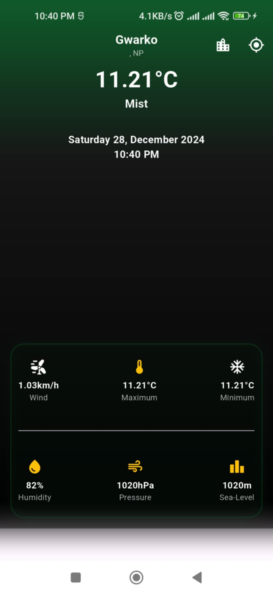

# Weather App
in nepali
This is a Flutter-based weather application that fetches real-time weather data using an API. The app provides information such as the current temperature, weather conditions, wind speed, humidity, atmospheric pressure, and sea level. Users can toggle the auto-location feature to get weather data for their current location or manually select a location.

## Features
- Displays real-time weather information.
- Provides data on:
  - Current temperature
  - Weather condition (e.g., Clouds, Clear, Rain)
  - Wind speed
  - Humidity
  - Atmospheric pressure
  - Sea level
- Auto-location to fetch weather for the user's current location.
- Manual location selection.

## Technologies Used
- **Flutter**: Frontend framework for building the app.
- **API Integration**: Fetches real-time weather data using a weather API.

## Screenshot


## Installation
1. Clone the repository:
   ```bash
   git clone https://github.com/Sagar11cc/WEATHER_APP_API.git
